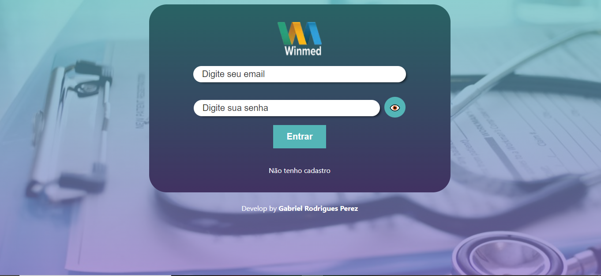
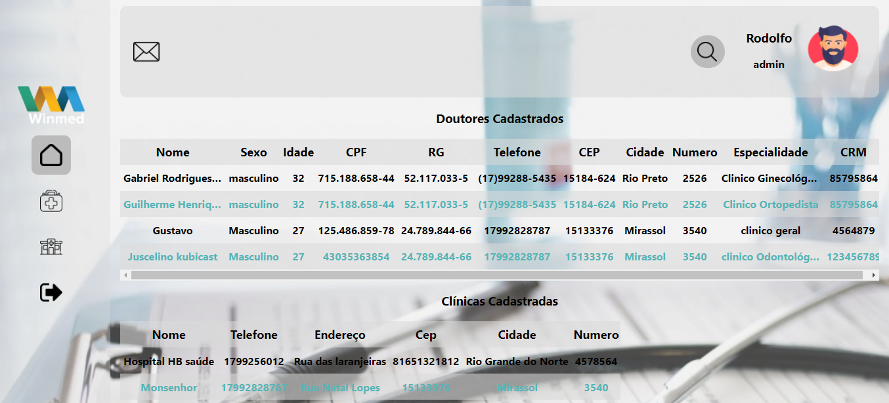

<h1 align="center">
  📃 Desafio Frontend Winmed 📃
</h1>

<p align="center">
   

  

  

  <br>
  
  <a href="https://www.codacy.com/manual/Gabriel4420/winmed-challenge-app-frontend?utm_source=github.com&amp;utm_medium=referral&amp;utm_content=Gabriel4420/winmed-challenge-app-frontend&amp;utm_campaign=Badge_Grade">
    
  </a>
  
  


  <a href="https://www.linkedin.com/in/gabriel-rodrigues-perez-2069b072/">
    
  </a>
</p>

---

<p align="center">
  
  
</p>

---

# Indice

- :rocket: [Sobre o Projeto](#rocket-sobre-o-projeto)
- 👨‍💻️ [Tecnogias utilizadas](#%EF%B8%8F-tecnogias-utilizadas)
- 📦️ [Como utilizar o projeto](#%EF%B8%8F-como-utilizar-o-projeto)
---

## :rocket: Sobre o Projeto

Escopo:
Em um ERP foi levantada a necessidade de atualizar o endereço da clínica de forma dinâmica.

Necessidade: 
- Ao preencher o CEP trazer da API informada os outros dados assim que o campo perder o foco .
- Ao Clicar na lua acima mudar para modo escuro conforme as imagens e vice e versa .

OBS geral :
- Reproduzir o layout conforme imagem com o máximo de fidignidade;
- Focar na funcionalidade apenas da section "Atualizar endereço da clínica", os outros elementos são opcionais;
- Trabalhar responsividade.

OBS :
- Não se preocupe em usar na integra o conteudo, foque em mostrar suas habilidades 
- Para integrar o CEP recomendamos a API ViaCEP


---

## 👨‍💻️ Tecnogias utilizadas

O projeto foi desenvolvido utilizando as seguintes tecnologias:

- [React](https://pt-br.reactjs.org)


### Dependências

  - [axios](https://axios-http.com/docs/intro)
  - [next](https://nextjs.org/docs)
  - [nookies](https://github.com/maticzav/nookies)
  - [bcryptjs](https://www.npmjs.com/package/bcryptjs)
  - [styled-components](https://styled-components.com/docs/basics)


### Padronização de código

  - [ESLint](https://eslint.org/)
  - [Prettier](https://prettier.io/)
  - :mouse: [Editor Config](https://editorconfig.org/)

### IDE

  - [Visual Studio Code](https://code.visualstudio.com/)

---

## 📦️ Como utilizar o projeto

Para copiar o projeto, utilize os comandos:

```bash
  # Clonar o repositório
  ❯ git clone https://github.com/Gabriel4420/winmed-challenge-app-frontend.git

```
Para instalar as dependências e iniciar o projeto, você pode utilizar o yarn ou npm:

**Utilizando npm**

*PS: utilize o npm install, para atualizar as dependências, tome cuidado, pois dependendo da versão da dependência, pode ser que o projeto não funcione como o esperado.*

```bash
  

  # Atualizar as dependências
  ❯ npm install
 
  # Iniciar o projeto
  ❯ npm dev
```

**Utilizando yarn**


```bash
  # Atualizar as dependências
  ❯ yarn

  # Iniciar o projeto
  ❯ yarn dev
```

---

<h4 align="center">
  Feito com ❤️ por Gabriel Rodrigues 👋️ <a href="mailto:gabriel_rodrigues_perez@hotmail.com">Entre em contato!</a>
</h4>

<p align="center">

  <a href="https://www.linkedin.com/in/gabriel-rodrigues-perez-2069b072/">
    
  </a>
  <a href="https://www.facebook.com/gabriel.rodrigues.perez">
    
  </a>
  <a href="https://www.instagram.com/gabriel_rodrigues_perez/">
    
  </a>
  
  
</p>